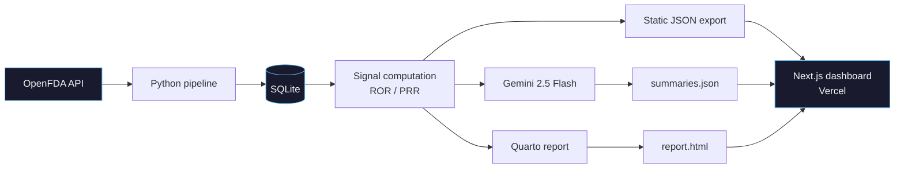

# Pharos

A pharmacovigilance signal-detection platform that ingests adverse-event data from the FDA, computes disproportionality statistics (ROR/PRR), and visualises drug safety signals through an interactive dashboard with AI-generated plain-language summaries.

Built to demonstrate data engineering, reproducible analysis, and clean deployment for computational biotech roles.

## What it does

Pharos pulls adverse-event reports from the [OpenFDA FAERS API](https://open.fda.gov/apis/drug/event/), builds a local database, and runs disproportionality analysis on every drug-reaction pair. Pairs that pass the **EVANS signal criterion** (ROR lower 95% CI > 1, PRR >= 2, n >= 3, chi-squared >= 4) are flagged as safety signals. A Next.js dashboard visualises the results with interactive forest plots, and Gemini 2.5 Flash generates plain-language summaries so non-scientists can understand each finding.

Data refreshes weekly via GitHub Actions. The dashboard reads static JSON — no runtime API calls from the browser.

## Architecture



## Stack

| Layer | Tool |
|---|---|
| Language | Python 3.11+ |
| Ingestion | requests, pandas |
| Database | SQLite (via SQLAlchemy) |
| Analysis | scipy, statsmodels |
| AI summaries | Gemini 2.5 Flash (server-side only, at refresh time) |
| Methodology report | Quarto (Python engine) |
| Frontend | Next.js 15 + Tailwind CSS |
| Charts | Hand-coded SVG forest plots |
| Deployment | Vercel (static export) |
| Refresh | GitHub Actions cron (weekly) |

## Signal detection methodology

For each drug-reaction pair, a 2x2 contingency table is constructed against all other drugs in the database.

**Reporting Odds Ratio (ROR):** Measures whether a drug-reaction pair is reported more often than expected. A 95% confidence interval is computed using the log-normal approximation.

**Proportional Reporting Ratio (PRR):** An alternative measure with an associated chi-squared statistic.

**Signal flag:** A pair is flagged when *all four* criteria pass simultaneously:
- ROR lower 95% CI > 1 (Rothman 2004)
- PRR >= 2, n >= 3, chi-squared >= 4 (Evans 2001 — the EVANS criterion)

A signal is not proof of causation. It flags a statistical anomaly in voluntary reporting data that warrants further investigation.

For the full methodology with formulas, zero-cell handling, and FAERS-specific limitations, see the [methodology report](analysis/report.qmd) (rendered at `/report.html` on the live dashboard).

**References:**
- Rothman KJ, Lanes S, Sacks ST. *The reporting odds ratio and its advantages over the proportional reporting ratio.* Pharmacoepidemiol Drug Saf. 2004; 13: 519-523.
- Evans SJW, Waller PC, Davis S. *Use of proportional reporting ratios (PRRs) for signal generation from spontaneous adverse drug reaction reports.* Pharmacoepidemiol Drug Saf. 2001; 10: 483-486.

## Getting started

```bash
# Clone
git clone https://github.com/Vanz23-23/Pharos_v1.git
cd Pharos_v1

# Install secret-scanner hook
git config core.hooksPath .githooks

# Python pipeline
pip install -r requirements.txt
python pipeline/run_refresh.py        # fetches data, computes signals, generates summaries

# Dashboard
cd dashboard
npm install
npm run dev                           # http://localhost:3000
```

The refresh pipeline requires an `OPENFDA_API_KEY` environment variable (free, 120k requests/day). AI summaries require a `GEMINI_API_KEY`. Both can be set in a `.env` file — see `.env.example`.

## Project structure

```
pharos/
├── pipeline/                   # Python ETL
│   ├── ingest.py               # OpenFDA fetcher (with 429 retry)
│   ├── clean.py                # Normalisation + deduplication
│   ├── normalise.py            # Drug name canonicalisation
│   ├── summarize.py            # Gemini AI summary generation (incremental)
│   ├── db.py                   # SQLite interface
│   ├── export.py               # Static JSON exports
│   ├── run_refresh.py          # Weekly orchestration entrypoint
│   └── tests/                  # pytest unit tests
├── analysis/
│   ├── disproportionality.py   # ROR/PRR computation
│   ├── report.qmd              # Quarto methodology report
│   └── tests/                  # pytest unit + integration tests
├── db/
│   └── schema.sql              # Source of truth for database schema
├── dashboard/                  # Next.js frontend
│   ├── app/                    # Pages (Home, Explore, Drug Profile, Signal Scores)
│   ├── components/             # UI components (forest plot, search, summaries)
│   ├── lib/                    # Design tokens, types
│   └── public/data/            # Static JSON (committed weekly by CI)
├── .github/workflows/
│   ├── refresh.yml             # Weekly data refresh cron
│   └── secret-scan.yml         # API key leak prevention
└── docs/                       # Career positioning, design handoff
```

## Known limitations

FAERS is a spontaneous-reporting database. Disproportionality analysis on FAERS data is useful for hypothesis generation, not causal evidence.

- **No exposure denominator.** FAERS records report counts, not patient-exposure time — ROR is *reporting* odds, not incidence.
- **Notoriety bias.** Media coverage inflates reporting rates; signals may reflect attention, not pharmacology.
- **Indication confounding.** A drug's indication can co-occur with the reaction independent of the drug itself.
- **Weber effect.** Reporting peaks 1-2 years after launch and decays — early signals are not comparable to late-cycle ones.
- **Unstratified background.** The comparator pool is all other drugs globally, with no stratification by therapeutic class or time window.

## License

[MIT](LICENSE)
